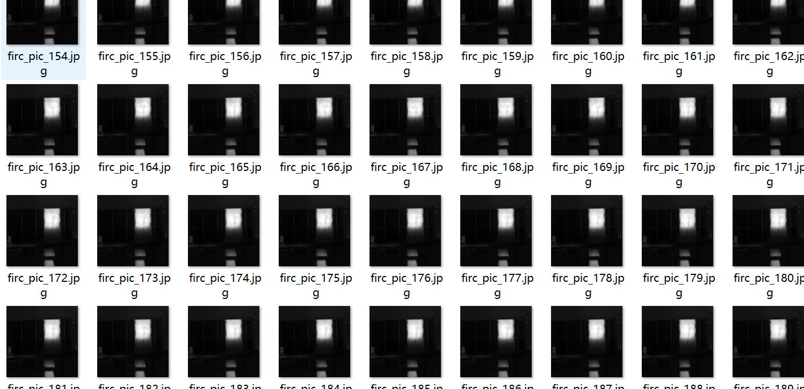
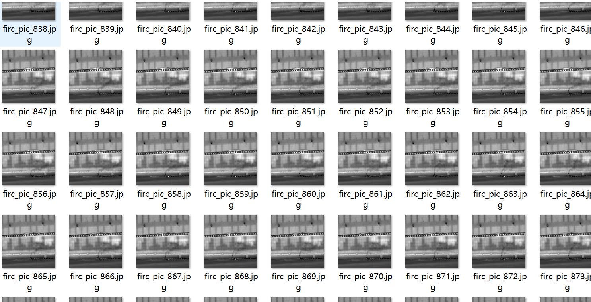
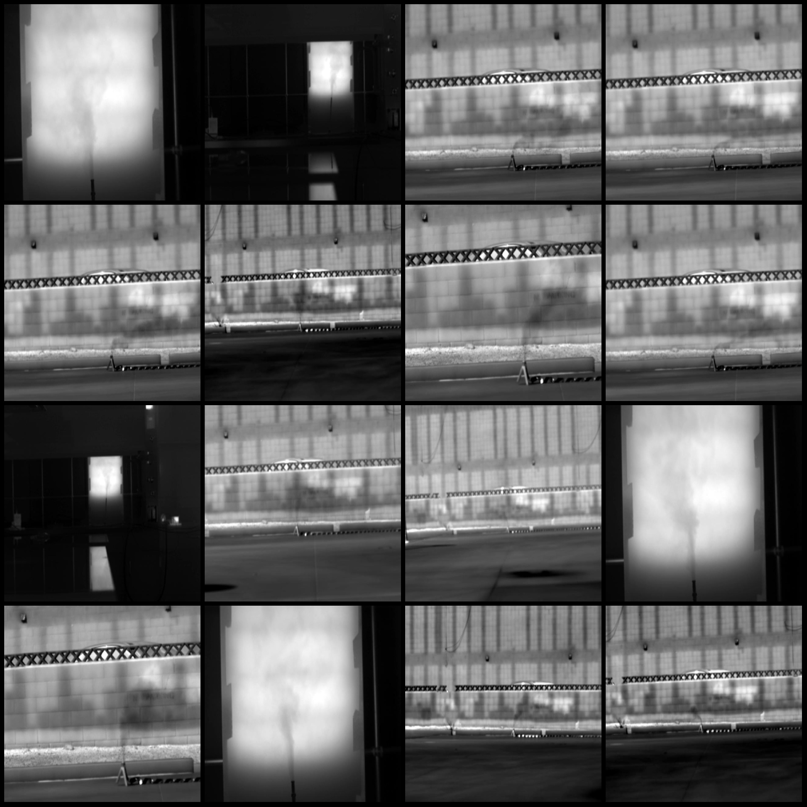
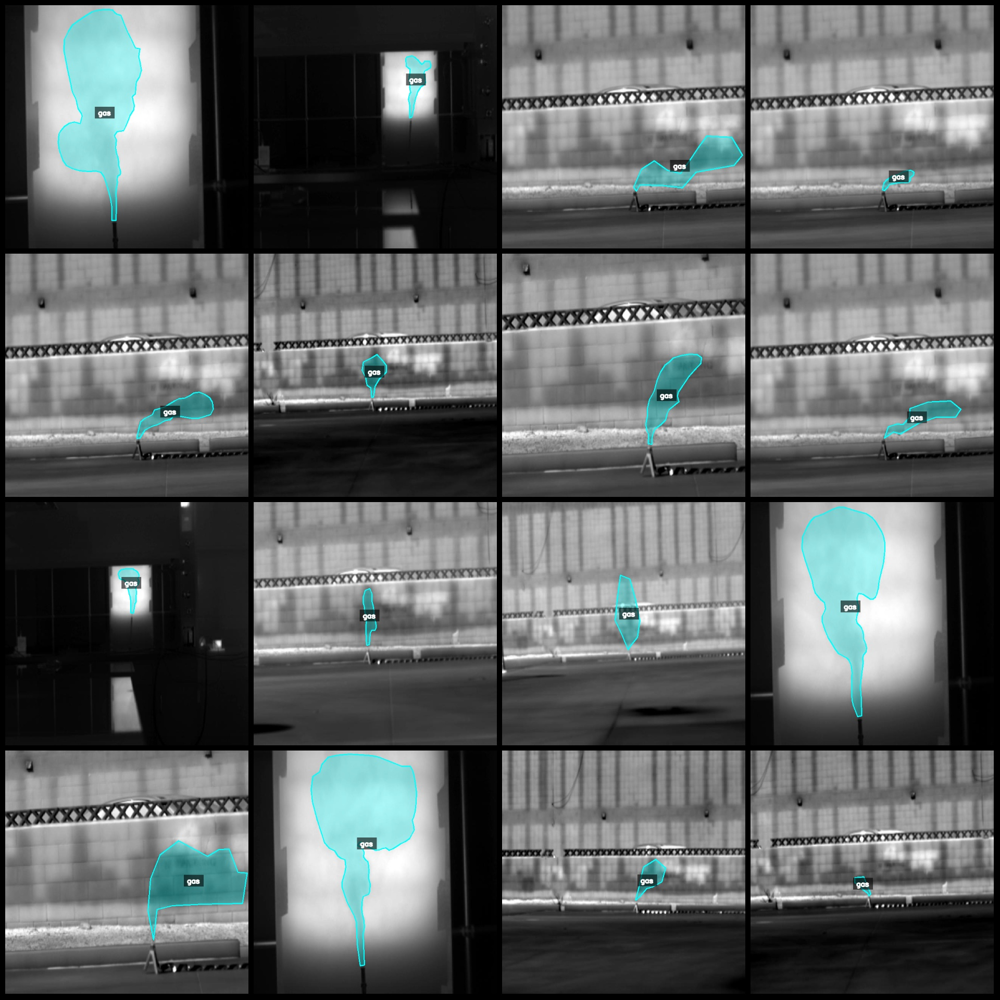
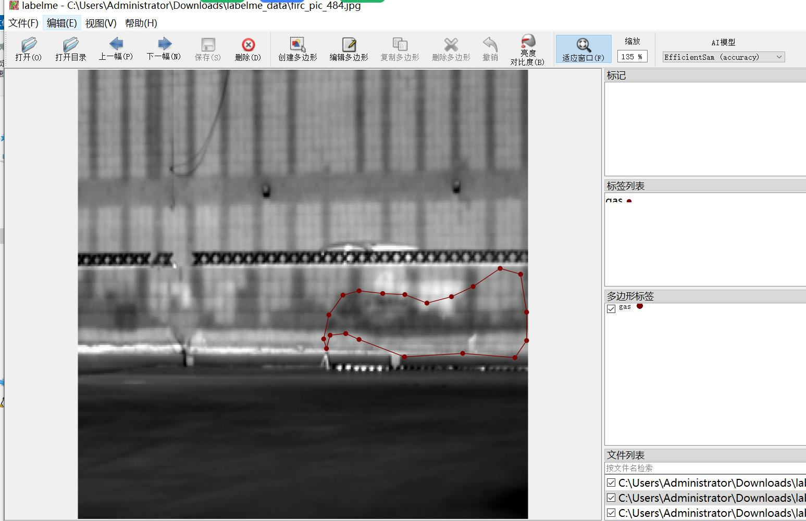
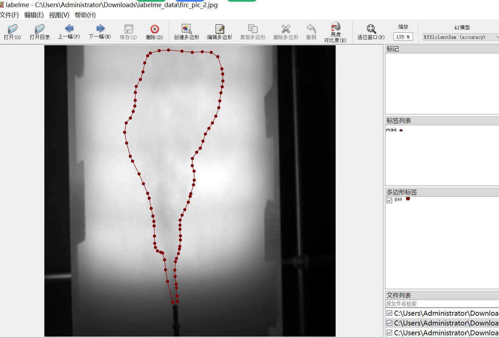

# Methane Gas Detection and Segmentation Dataset

The dataset consists of 1175 labeled images for gas detection and segmentation. The format is labelme, without the mask files, only containing JPG images and their corresponding JSON files.

- Number of images (JPG file count): 1175
- Number of annotations (JSON file count): 1175
- Number of categories: 1
- Category name: "gas"
- Number of bounding boxes per category: 1175
- Tool used for annotation: labelme=5.5.0
- Image resolution: 640x640
- Annotated rules: Polygons are drawn around the category.

Special Note: This dataset can be edited using labelme. The JSON dataset needs to be converted into either Yolo or COCO format for semantic segmentation or instance segmentation.

Disclaimer: This dataset does not guarantee the accuracy of the trained models or weights files.

Image Preview:

Annotation Example:

Original Images (randomly selected 16):

Annotation drawing result:

Labelme editing image example:

## Images

Here is a pay link on Stripe ( https://buy.stripe.com/3cs8yP7sY87d0vu9AB ). Please contact me lonlonago@foxmail.com after funding $89, and I will send you a complete data files , thank you!

